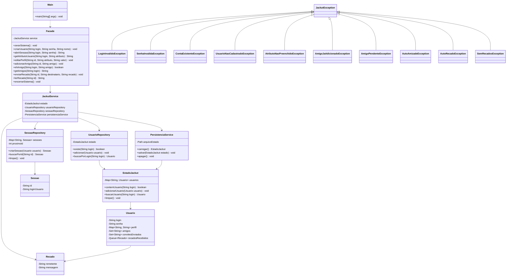

# Relatorio - Milestone 1 - Jackut

Nome: Victor André Lopes Brasileiro

Matricula: 202407269

Projeto: Rede de Relacionamentos Jackut

Disciplina: Programacao 2 - UFAL/IC

---

## 1. Introducao

O Jackut e um sistema de rede de relacionamentos inspirado em redes sociais classicas. O objetivo do projeto e implementar a logica de negocio necessaria para atender aos testes de aceitacao fornecidos em EasyAccept. Neste milestone, o sistema cobre a criacao de contas, a edicao de perfis, a adicao de amigos e o envio de recados entre usuarios.

## 2. Escopo Do Milestone 1

O primeiro milestone contempla as User Stories 1 a 4 do projeto Jackut.

| User Story | Titulo | Escopo implementado |
| --- | --- | --- |
| US1 | Criacao de conta | Criacao de usuario, validacao de login e senha, abertura de sessao, consulta de atributo `nome`, encerramento e limpeza do sistema |
| US2 | Criacao e edicao de perfil | Edicao de atributos dinamicos do perfil e consulta de atributos existentes ou ausentes |
| US3 | Adicao de amigos | Registro de convite de amizade, confirmacao por adicao reciproca, consulta e listagem de amigos |
| US4 | Envio de recados | Envio de recado para outro usuario, leitura em ordem de chegada, remocao apos leitura e persistencia de recados pendentes |

Os scripts de aceitacao utilizados neste milestone estao em `jackut_project/tests`:

```text
us1_1.txt
us1_2.txt
us2_1.txt
us2_2.txt
us3_1.txt
us3_2.txt
us4_1.txt
us4_2.txt
```

## 3. Comandos Publicos Da Facade

A classe `br.ufal.ic.p2.jackut.Facade` expoe os comandos esperados pelos testes de aceitacao. A tabela abaixo relaciona cada comando ao seu objetivo no sistema.

| Metodo | Retorno | User Story | Objetivo |
| --- | --- | --- | --- |
| `zerarSistema()` | `void` | US1 | Limpar estado em memoria, sessoes e dados persistidos |
| `criarUsuario(login, senha, nome)` | `void` | US1 | Criar uma conta com login unico, senha e nome |
| `abrirSessao(login, senha)` | `String` | US1 | Autenticar usuario e criar uma sessao |
| `getAtributoUsuario(login, atributo)` | `String` | US1/US2 | Consultar atributo de perfil de um usuario |
| `editarPerfil(id, atributo, valor)` | `void` | US2 | Alterar ou criar um atributo de perfil em sessao autenticada |
| `adicionarAmigo(id, amigo)` | `void` | US3 | Solicitar ou confirmar amizade |
| `ehAmigo(login, amigo)` | `boolean` | US3 | Verificar se dois usuarios sao amigos |
| `getAmigos(login)` | `String` | US3 | Listar amigos no formato esperado pelo EasyAccept |
| `enviarRecado(id, destinatario, recado)` | `void` | US4 | Enviar recado para outro usuario cadastrado |
| `lerRecado(id)` | `String` | US4 | Ler e remover o primeiro recado da fila do usuario autenticado |
| `encerrarSistema()` | `void` | US1-US4 | Salvar o estado persistente do sistema |


## 4. Visao Geral Da Arquitetura

A arquitetura adotada separa o ponto de entrada dos testes, a coordenacao dos casos de uso, as entidades de dominio, o acesso ao estado e a persistencia. O fluxo geral e:

```text
EasyAccept
    |
    v
Facade
    |
    v
JackutService
    |--------------------|
    v                    v
Repositories         PersistenciaService
    |
    v
Models / EstadoJackut
```

O EasyAccept conhece apenas a `Facade`. A `Facade` delega para `JackutService`. O service coordena os casos de uso e chama repositories, models e persistencia conforme a necessidade. Os repositories evitam que o estado persistente seja manipulado livremente por outras classes. Os models protegem os dados e regras associados aos usuarios, sessoes e recados.

Essa organizacao busca equilibrar simplicidade e qualidade. Como o milestone ainda cobre um conjunto pequeno de funcionalidades, foi evitada a criacao de muitos services especializados antes que houvesse complexidade real para justificar isso. Ao mesmo tempo, as responsabilidades centrais ja foram separadas para permitir evolucao nas proximas User Stories.

## 5. Estrutura Do Projeto

A estrutura principal do codigo-fonte e:

```text
jackut_project/src/br/ufal/ic/p2/jackut/
|-- Main.java
|-- Facade.java
|-- services/
|   `-- JackutService.java
|-- repositories/
|   |-- SessaoRepository.java
|   `-- UsuarioRepository.java
|-- models/
|   |-- EstadoJackut.java
|   |-- Recado.java
|   |-- Sessao.java
|   `-- Usuario.java
|-- persistence/
|   `-- PersistenciaService.java
`-- exceptions/
    |-- AmigoJaAdicionadoException.java
    |-- AmigoPendenteException.java
    |-- AtributoNaoPreenchidoException.java
    |-- AutoAmizadeException.java
    |-- AutoRecadoException.java
    |-- ContaExistenteException.java
    |-- JackutException.java
    |-- LoginInvalidoException.java
    |-- LoginOuSenhaInvalidosException.java
    |-- MensagensErro.java
    |-- SemRecadosException.java
    |-- SenhaInvalidaException.java
    `-- UsuarioNaoCadastradoException.java
```

Essa divisao evita concentrar regras em uma unica classe e deixa claro onde cada tipo de responsabilidade deve ficar.

## 6. Componentes Principais

### 6.1 Main

`Main` e o ponto de execucao dos scripts de aceitacao. Sua responsabilidade e localizar a pasta `tests` a partir de diferentes diretorios de trabalho e acionar o EasyAccept com os scripts da US1 ate a US4.

Ela nao cria usuarios, nao valida regras de negocio e nao manipula persistencia. Seu papel e operacional: facilitar a execucao dos testes dentro e fora da IDE, usando caminhos relativos.

### 6.2 Facade

`Facade` e a interface publica do sistema para os testes. Cada metodo da facade corresponde a um comando usado pelos scripts do EasyAccept. A implementacao dos metodos e apenas delegacao para `JackutService`.

Essa decisao protege a arquitetura porque impede que a `Facade` vire uma classe central cheia de validacoes, mapas e regras. Se um requisito muda, a alteracao tende a ocorrer em service, model, repository ou exception, nao na entrada publica.

### 6.3 JackutService

`JackutService` coordena os casos de uso do milestone. Ele realiza validacoes de fluxo, busca usuarios e sessoes, chama metodos de dominio e aciona a persistencia nos comandos de encerramento e limpeza.

Exemplos de responsabilidades do service:

- validar login e senha na criacao de usuario;
- autenticar usuario na abertura de sessao;
- localizar usuario autenticado por id de sessao;
- coordenar convite e confirmacao de amizade;
- coordenar envio e leitura de recados;
- formatar a lista de amigos no formato esperado pelo EasyAccept;
- salvar, carregar e apagar o estado persistente por meio de `PersistenciaService`.

### 6.4 EstadoJackut

`EstadoJackut` representa o estado persistente do sistema. Atualmente ele guarda os usuarios cadastrados em uma estrutura associada ao login.

Ele oferece operacoes com intencao clara, como adicionar usuario, buscar usuario e limpar o estado. A ideia e evitar que qualquer classe manipule diretamente um mapa publico de usuarios. O estado existe para ser salvo e carregado como uma unidade coesa.

### 6.5 Usuario

`Usuario` e a principal entidade de dominio do milestone. Ela armazena login, senha, perfil, amigos confirmados, convites enviados e recados recebidos.

As regras diretamente ligadas ao estado de um usuario ficam dentro da propria entidade. Por exemplo, `Usuario` sabe editar seu perfil, registrar convite enviado, confirmar amigo, receber recado, verificar se possui recado e remover o proximo recado da fila. Isso evita manipulacoes externas do tipo buscar uma lista interna e alterar essa lista por fora.

O login e a senha sao definidos na criacao da conta e nao possuem setters publicos. As colecoes internas tambem nao sao expostas para modificacao externa.

### 6.6 Sessao

`Sessao` liga um id de sessao ao login do usuario autenticado. Ela e usada por comandos que exigem autenticacao, como `editarPerfil`, `adicionarAmigo`, `enviarRecado` e `lerRecado`.

As sessoes ficam em memoria e nao sao persistidas. Essa escolha e adequada ao contrato atual porque os testes reabrem sessoes apos carregar dados persistidos. Persistir sessoes poderia misturar estado temporario de autenticacao com dados permanentes da rede social.

### 6.7 Recado

`Recado` representa uma mensagem enviada de um usuario para outro. Ele guarda o remetente e a mensagem. Mesmo que os testes atuais retornem apenas o texto do recado, manter o remetente no objeto deixa a modelagem mais fiel ao dominio e permite evolucao futura sem trocar a estrutura basica.

Os recados sao mantidos em fila dentro de `Usuario`, garantindo leitura em ordem de chegada.

### 6.8 UsuarioRepository

`UsuarioRepository` isola o acesso a usuarios cadastrados. Ele depende de `EstadoJackut` e oferece operacoes como verificar existencia, adicionar usuario e buscar por login.

Sem esse repository, o service precisaria conhecer diretamente a estrutura interna do estado. Com o repository, o acesso fica mais controlado e preparado para futuras mudancas de armazenamento.

### 6.9 SessaoRepository

`SessaoRepository` controla as sessoes abertas. Ele cria ids sequenciais, registra sessoes, busca sessao por id e limpa sessoes quando o sistema e zerado.

Separar sessoes em um repository proprio deixa claro que sessoes sao estado de execucao, nao parte do estado persistente principal.

### 6.10 PersistenciaService

`PersistenciaService` carrega, salva e apaga o estado serializado do Jackut. Ele usa `ObjectInputStream` e `ObjectOutputStream` para persistir `EstadoJackut`.

Tambem e responsavel por localizar o arquivo de dados usando caminhos relativos. Isso atende a recomendacao do projeto de nao depender de caminhos absolutos da maquina do desenvolvedor.

### 6.11 Exceptions

O pacote `exceptions` contem erros de dominio especificos. Cada erro importante tem uma classe propria, como `LoginInvalidoException`, `ContaExistenteException`, `AmigoPendenteException` e `SemRecadosException`.

As mensagens esperadas pelo EasyAccept ficam centralizadas nessas classes. Isso evita duplicacao de strings em varias partes do codigo e torna mais facil verificar o contrato de erro.

## 7. Diagrama De Classes

O diagrama abaixo mostra as principais relacoes entre as classes do milestone.



## 8. Fluxos De Funcionamento

### 8.1 Criacao De Usuario

O fluxo de `criarUsuario` comeca na `Facade` e e encaminhado para `JackutService`. O service valida se o login e a senha foram preenchidos. Depois consulta `UsuarioRepository` para verificar se o login ja existe. Se nao houver erro, cria uma instancia de `Usuario` e pede ao repository para registra-la no `EstadoJackut`.

Esse fluxo separa validacao de caso de uso, armazenamento e modelagem de usuario. A `Facade` nao precisa conhecer o mapa de usuarios nem a regra de login unico.

### 8.2 Abertura De Sessao

Em `abrirSessao`, o service busca o usuario pelo login e compara a senha informada com a senha armazenada no usuario. Caso a autenticacao falhe, o sistema lanca uma excecao unica para login ou senha invalidos, sem indicar qual dos dois campos causou o problema.

Se a autenticacao for bem-sucedida, `SessaoRepository` cria uma nova sessao e retorna seu id. Esse id e usado em comandos autenticados posteriores.

### 8.3 Consulta E Edicao De Perfil

`getAtributoUsuario` busca o usuario pelo login, verifica se o atributo existe e retorna seu valor. Se o usuario nao existir ou se o atributo nao estiver preenchido, o erro de dominio correspondente e lancado.

`editarPerfil` exige sessao valida. O service localiza o usuario autenticado e delega a alteracao para `Usuario`. O perfil e dinamico porque a US2 permite criar ou editar qualquer atributo, nao apenas campos fixos.

### 8.4 Adicao De Amigos

O relacionamento de amizade segue a regra de adicao reciproca. Quando um usuario adiciona outro pela primeira vez, o sistema registra um convite pendente no usuario que fez a solicitacao. A amizade ainda nao existe nesse momento.

Quando o usuario destinatario tambem adiciona quem ja havia enviado o convite, o service identifica o convite pendente, remove esse convite e confirma a amizade nos dois usuarios. O uso de colecoes sem duplicidade evita repeticao de amigos e ajuda a preservar consistencia.

O fluxo tambem trata casos invalidos, como usuario inexistente, auto-adicao, amizade ja confirmada e convite ja pendente.

### 8.5 Listagem De Amigos

`getAmigos` busca o usuario e recupera uma lista imutavel de amigos a partir da entidade `Usuario`. O service formata a lista no padrao esperado pelo EasyAccept, com chaves e nomes separados por virgula.

A formatacao para teste fica fora da entidade, evitando que `Usuario` conheca detalhes de representacao textual exigidos pelo EasyAccept.

### 8.6 Envio De Recado

`enviarRecado` exige uma sessao valida para identificar o remetente. Depois o service busca o destinatario pelo login. Se o destinatario nao existir ou se o remetente tentar enviar recado para si mesmo, a excecao apropriada e lancada.

Quando o envio e valido, o service cria um `Recado` e pede ao destinatario para recebe-lo. A fila de recados pertence ao proprio usuario destinatario.

### 8.7 Leitura De Recado

`lerRecado` localiza o usuario autenticado por sessao. Se a fila de recados estiver vazia, o sistema lanca `SemRecadosException`. Caso contrario, o usuario remove e retorna o primeiro recado recebido.

Essa escolha implementa o comportamento FIFO exigido pelos testes: o primeiro recado enviado ao usuario e o primeiro a ser lido.

### 8.8 Encerramento E Persistencia

`encerrarSistema` delega ao `PersistenciaService` o salvamento do `EstadoJackut`. Esse estado inclui usuarios, perfis, amizades, convites e recados ainda nao lidos.

As sessoes nao sao salvas porque representam autenticacao temporaria. Apos reiniciar o sistema, os usuarios podem abrir novas sessoes e continuar acessando os dados persistidos.

### 8.9 Limpeza Do Sistema

`zerarSistema` limpa o estado em memoria, remove sessoes abertas e apaga o arquivo persistido. Esse comportamento e necessario porque varios scripts de aceitacao iniciam zerando o sistema para garantir isolamento entre testes.

## 9. Tratamento De Erros

Os erros de negocio sao representados por excecoes especificas. A tabela abaixo relaciona as principais excecoes, mensagens e situacoes de uso.

| Excecao | Mensagem | Situacao |
| --- | --- | --- |
| `LoginInvalidoException` | `Login inválido.` | Criacao de usuario com login vazio |
| `SenhaInvalidaException` | `Senha inválida.` | Criacao de usuario com senha vazia |
| `ContaExistenteException` | `Conta com esse nome já existe.` | Tentativa de criar usuario com login ja cadastrado |
| `LoginOuSenhaInvalidosException` | `Login ou senha inválidos.` | Falha na autenticacao |
| `UsuarioNaoCadastradoException` | `Usuário não cadastrado.` | Usuario inexistente, destinatario inexistente ou sessao invalida |
| `AtributoNaoPreenchidoException` | `Atributo não preenchido.` | Consulta de atributo ausente |
| `AutoAmizadeException` | `Usuário não pode adicionar a si mesmo como amigo.` | Usuario tenta adicionar a si mesmo |
| `AmigoJaAdicionadoException` | `Usuário já está adicionado como amigo.` | Amizade ja confirmada |
| `AmigoPendenteException` | `Usuário já está adicionado como amigo, esperando aceitação do convite.` | Convite ja enviado e ainda nao aceito |
| `AutoRecadoException` | `Usuário não pode enviar recado para si mesmo.` | Usuario tenta enviar recado para si mesmo |
| `SemRecadosException` | `Não há recados.` | Usuario tenta ler recado com fila vazia |

## 10. Persistencia

A persistencia e feita por serializacao Java. O objeto persistido e `EstadoJackut`, que representa o conjunto de dados permanentes do sistema. O arquivo usado e `jackut.ser`, localizado em uma pasta `dados` encontrada por caminho relativo.

`PersistenciaService` tenta localizar a pasta de dados em locais relativos ao diretorio de execucao, como `../dados`, `dados` ou `P2-2023.1-JACKUT/dados`. Isso permite que o sistema rode tanto a partir de `jackut_project` quanto de outras raizes usadas pela IDE ou pelos testes.

Os dados persistidos incluem:

- usuarios cadastrados;
- atributos de perfil;
- amigos confirmados;
- convites pendentes;
- recados ainda nao lidos.

## 11. Decisoes De Design

### 11.1 Facade Fina

A `Facade` foi mantida como uma camada de entrada simples. Ela nao possui mapas, listas, acesso a arquivo ou regras de amizade, perfil e recado. Isso evita que uma classe criada apenas para o EasyAccept vire o centro do sistema.

### 11.2 Service Como Coordenador

`JackutService` concentra a coordenacao dos casos de uso porque, no milestone 1, ainda nao ha complexidade suficiente para dividir em varios services especializados. Essa decisao evita camadas vazias e mantem a implementacao simples.

Ao mesmo tempo, o service nao substitui o dominio. Ele nao altera colecoes internas diretamente, mas chama metodos com intencao nos models, como `editarPerfil`, `solicitarAmizade`, `adicionarAmigoConfirmado`, `receberRecado` e `lerProximoRecado`.

### 11.3 Entidades Com Comportamento

`Usuario` nao foi modelado apenas como uma classe de dados. Ele protege informacoes sensiveis e controla seu proprio estado. A senha nao e exposta para comparacao externa por getter publico; a verificacao e feita por `senhaConfere`. Amigos e convites tambem sao alterados por metodos da propria entidade.

### 11.4 Colecoes Protegidas

A lista de amigos retornada por `Usuario` e uma copia imutavel. Assim, outra classe pode consultar os amigos, mas nao consegue adicionar ou remover elementos diretamente da colecao interna.

Para recados, a colecao nem precisa ser exposta. O usuario oferece operacoes de dominio: receber recado, verificar se existe recado e ler o proximo recado.

### 11.5 Estado Persistente Coeso

Manter `EstadoJackut` como objeto persistente unico simplifica o salvamento e carregamento. Em vez de coordenar varios arquivos, o sistema salva um retrato do estado de dominio. Ainda assim, o acesso a esse estado e mediado por repositories.

### 11.6 Caminhos Relativos

O projeto evita caminhos absolutos. Essa decisao segue a recomendacao do enunciado, pois o professor pode baixar e executar o repositorio em uma maquina diferente. A localizacao do arquivo persistido e resolvida de forma relativa.

### 11.7 Documentacao Fora Do Codigo

O codigo-fonte usa Javadocs para documentar pacotes, classes e contratos publicos. Comentarios avulsos foram evitados para manter o codigo limpo. A documentacao de arquitetura, decisoes e funcionamento fica em arquivos externos, como `README.md` e este relatorio.

## 12. Padroes De Projeto Utilizados

### 12.1 Facade

#### Descricao Geral

O padrao Facade fornece uma interface simplificada para um conjunto de classes e subsistemas. Em vez de o cliente conhecer varias classes internas, ele interage com uma unica classe de entrada, que encaminha as chamadas para os objetos responsaveis.

#### Problema Resolvido

O EasyAccept precisa chamar metodos publicos com nomes e parametros especificos. Sem uma facade, os testes poderiam depender diretamente de services, repositories ou models, aumentando o acoplamento entre o contrato externo e a implementacao interna.

#### Identificacao Da Oportunidade

O enunciado do projeto exige uma facade para que os testes de aceitacao acessem a logica de negocio. Ao analisar os scripts, ficou claro que todos os comandos externos deveriam ser concentrados em uma classe publica estavel, mas sem colocar nela as regras do sistema.

#### Aplicacao No Projeto

A classe `br.ufal.ic.p2.jackut.Facade` implementa esse padrao. Ela expoe metodos como `criarUsuario`, `abrirSessao`, `editarPerfil`, `adicionarAmigo`, `enviarRecado` e `lerRecado`. Cada metodo delega para `JackutService`.

Com isso, o EasyAccept conhece apenas a `Facade`, enquanto regras de dominio, persistencia e acesso ao estado permanecem em outras classes.

### 12.2 Service Layer

#### Descricao Geral

Service Layer organiza a logica de aplicacao em uma camada responsavel por coordenar casos de uso. Essa camada recebe operacoes externas, valida o fluxo principal e chama entidades, repositories e servicos de infraestrutura.

#### Problema Resolvido

Sem uma camada de servico, a `Facade` tenderia a concentrar validacoes, buscas, persistencia e regras de amizade e recado. Isso prejudicaria manutencao e evolucao, especialmente quando novas User Stories fossem adicionadas.

#### Identificacao Da Oportunidade

Os comandos do milestone envolvem mais de uma entidade ou componente. Por exemplo, `adicionarAmigo` precisa validar sessao, buscar dois usuarios, verificar convite pendente e confirmar amizade nos dois lados. Esse tipo de coordenacao nao pertence nem a `Facade` nem a uma entidade isolada.

#### Aplicacao No Projeto

`JackutService` e a camada de servico do projeto. Ele coordena criacao de conta, login, edicao de perfil, amizade, recados, encerramento e limpeza do sistema. Ele tambem chama `UsuarioRepository`, `SessaoRepository`, `PersistenciaService` e os metodos de dominio de `Usuario`.

### 12.3 Repository

#### Descricao Geral

Repository encapsula o acesso a colecoes de entidades. Ele oferece uma interface orientada ao dominio para buscar, adicionar ou consultar objetos, escondendo detalhes da estrutura de armazenamento usada internamente.

#### Problema Resolvido

O estado do Jackut usa estruturas como mapas para localizar usuarios e sessoes. Se services e outras classes acessassem esses mapas diretamente, o acoplamento aumentaria e seria mais facil modificar o estado de forma indevida.

#### Identificacao Da Oportunidade

A US1 ja exigia cadastro e busca de usuarios por login. A abertura de sessao tambem exigia um controle proprio de sessoes. Essas duas areas indicaram a necessidade de objetos responsaveis por acesso controlado ao estado.

#### Aplicacao No Projeto

`UsuarioRepository` oferece metodos como `existe`, `adicionar` e `buscarPorLogin`, usando `EstadoJackut` internamente. `SessaoRepository` oferece `criarSessao`, `buscarPorId` e `limpar`, mantendo sessoes em memoria. O service usa esses repositories sem manipular diretamente as estruturas internas.

### 12.4 Domain Model

#### Descricao Geral

Domain Model representa conceitos do dominio por meio de entidades que possuem dados e comportamento. Em vez de manter objetos passivos e concentrar toda a logica em services, as entidades protegem invariantes e oferecem operacoes coerentes com o negocio.

#### Problema Resolvido

Um risco comum em projetos pequenos e transformar entidades em simples estruturas de dados com getters e setters, deixando todas as regras em uma classe central. Isso enfraquece encapsulamento e facilita estados invalidos.

#### Identificacao Da Oportunidade

As User Stories mostram que usuarios nao sao apenas registros. Eles possuem perfil, senha, amigos, convites e recados. Cada uma dessas informacoes tem regras proprias, como confirmar amizade somente por reciprocidade e ler recados em ordem de chegada.

#### Aplicacao No Projeto

`Usuario` implementa comportamento de dominio: `senhaConfere`, `editarPerfil`, `solicitarAmizade`, `possuiConviteEnviado`, `removerConviteEnviado`, `adicionarAmigoConfirmado`, `ehAmigo`, `receberRecado`, `possuiRecado` e `lerProximoRecado`. `Sessao` representa autenticacao temporaria e `Recado` representa uma mensagem recebida.

### 12.5 State Snapshot

#### Descricao Geral

State Snapshot consiste em reunir o estado relevante do sistema em um objeto coeso que pode ser salvo, carregado ou descartado como uma unidade. Ele nao substitui as entidades do dominio, mas facilita persistencia e restauracao do estado.

#### Problema Resolvido

O sistema precisa persistir dados entre scripts, especialmente entre os arquivos `usX_1.txt` e `usX_2.txt`. Salvar cada parte do estado em arquivos separados aumentaria a complexidade sem necessidade no milestone 1.

#### Identificacao Da Oportunidade

As User Stories exigem que usuarios, perfis, amizades e recados pendentes sobrevivam ao encerramento do sistema. Ao mesmo tempo, sessoes devem ser recriadas depois. Isso sugeriu separar estado persistente de estado temporario.

#### Aplicacao No Projeto

`EstadoJackut` agrupa os usuarios cadastrados e tudo que pertence a eles. `PersistenciaService` serializa e desserializa esse estado em arquivo. `SessaoRepository`, por sua vez, fica fora do snapshot persistido, pois controla apenas sessoes abertas em memoria.

### 12.6 Hierarquia De Excecoes De Dominio

#### Descricao Geral

Uma hierarquia de excecoes organiza erros relacionados sob uma excecao base. Cada erro especifico ganha uma classe propria, facilitando leitura, manutencao e controle das mensagens de falha.

#### Problema Resolvido

Os testes do EasyAccept dependem de mensagens exatas. Se as mensagens fossem repetidas diretamente no service, qualquer alteracao poderia gerar inconsistencia. Alem disso, `throw new RuntimeException("...")` deixaria menos claro qual regra foi violada.

#### Identificacao Da Oportunidade

Desde a US1 os testes exigem mensagens especificas para login invalido, senha invalida, usuario inexistente e conta duplicada. Nas US seguintes, surgem novos erros de perfil, amizade e recado. A quantidade de erros justificou classes especificas.

#### Aplicacao No Projeto

`JackutException` e a excecao base do dominio. Classes como `ContaExistenteException`, `AtributoNaoPreenchidoException`, `AmigoPendenteException` e `SemRecadosException` representam falhas especificas. O service lanca essas excecoes pelo nome da regra violada, e nao por uma string generica.

## 13. Qualidade Arquitetural

O projeto segue alguns criterios de qualidade definidos para evitar os problemas comuns de projetos pequenos:

- a `Facade` permanece fina e sem regra de negocio;
- a persistencia nao valida regras de dominio;
- models protegem colecoes e estado sensivel;
- repositories escondem detalhes do estado interno;
- exceptions concentram mensagens do contrato;
- caminhos de arquivo sao relativos;
- o codigo-fonte possui Javadocs objetivos e evita comentarios avulsos;
- a documentacao externa descreve a arquitetura real implementada.

## 14. Execucao E Verificacao

Para compilar o projeto a partir de `jackut_project`, pode ser usado:

```powershell
javac -encoding UTF-8 -cp "lib\easyaccept.jar" -d "out\verification" `
  (Get-ChildItem -Path "src" -Recurse -Filter "*.java").FullName
```

Para executar todos os scripts do milestone pela `Main`:

```powershell
java "-Dfile.encoding=UTF-8" -cp "out\verification;lib\easyaccept.jar" br.ufal.ic.p2.jackut.Main
```

Para executar um script especifico diretamente pelo EasyAccept:

```powershell
java "-Dfile.encoding=UTF-8" -cp "out\verification;lib\easyaccept.jar" easyaccept.EasyAccept `
  br.ufal.ic.p2.jackut.Facade tests\us1_1.txt
```

O uso de `-Dfile.encoding=UTF-8` ajuda a manter comportamento consistente ao executar os testes em ambientes Windows, especialmente quando mensagens acentuadas estao envolvidas.
