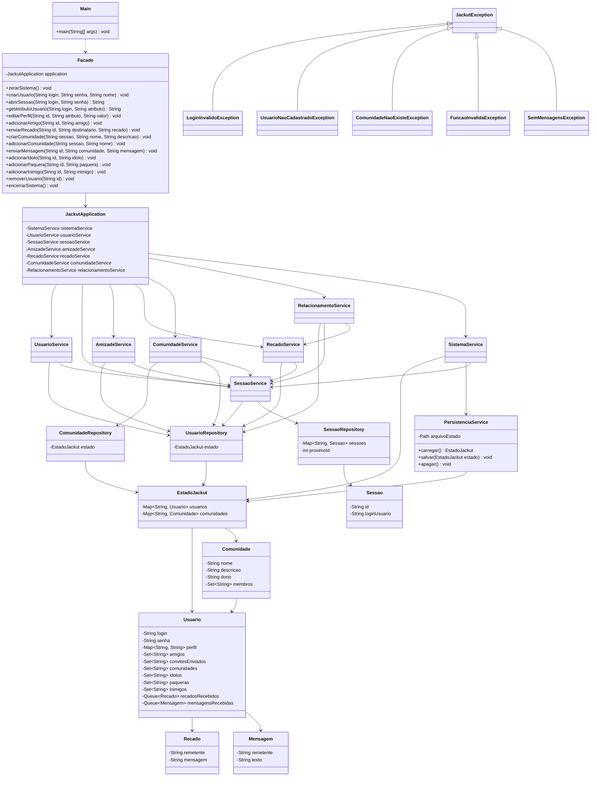

# Relatorio - Milestone 2 - Jackut

Nome: Victor André Lopes Brasileiro

Matricula: 202407269

Projeto: Rede de Relacionamentos Jackut

Disciplina: Programacao 2 - UFAL/IC

---

## 1. Introducao

O Jackut e um sistema de rede de relacionamentos inspirado em redes sociais classicas. O objetivo do projeto e implementar a logica de negocio necessaria para atender aos testes de aceitacao fornecidos em EasyAccept, preservando uma arquitetura simples, modular e preparada para evolucao incremental.

No Milestone 2, o sistema foi ampliado para cobrir comunidades, participacao em comunidades, mensagens coletivas, novos tipos de relacionamento social e remocao de conta. Alem das novas funcionalidades, este milestone tambem incorporou as observacoes recebidas na avaliacao do Milestone 1: a antiga concentracao de responsabilidades em um unico service foi substituida por uma camada de aplicacao dividida por areas funcionais, e as excecoes de dominio passaram a ser excecoes verificadas, herdando de `Exception` por meio de `JackutException`.

Com isso, o projeto atual cobre as User Stories 1 a 9, mantendo compatibilidade com as funcionalidades ja entregues e adicionando as regras novas exigidas pelos scripts do Milestone 2.

## 2. Escopo Do Milestone 2

O segundo milestone contempla as User Stories 5 a 9, alem da retestagem das User Stories 1 a 4 ja implementadas no milestone anterior.

| User Story | Titulo | Escopo implementado |
| --- | --- | --- |
| US1 | Criacao de conta | Criacao de usuario, validacao de login e senha, abertura de sessao, consulta de atributo `nome`, encerramento e limpeza do sistema |
| US2 | Criacao e edicao de perfil | Edicao de atributos dinamicos do perfil e consulta de atributos existentes ou ausentes |
| US3 | Adicao de amigos | Registro de convite de amizade, confirmacao por adicao reciproca, consulta e listagem de amigos |
| US4 | Envio de recados | Envio de recado privado, leitura em ordem de chegada, remocao apos leitura e persistencia de recados pendentes |
| US5 | Criacao de comunidades | Criacao de comunidade com nome unico, descricao, dono e membro inicial |
| US6 | Adicao de comunidades | Entrada de usuarios em comunidades existentes e listagem das comunidades de cada usuario |
| US7 | Envio de mensagens a comunidades | Envio de mensagens coletivas para membros de uma comunidade, com fila propria separada dos recados privados |
| US8 | Criacao de novos relacionamentos | Relacoes de fa-idolo, paquera e inimizade, incluindo bloqueios, consultas e recados automaticos |
| US9 | Remocao de conta | Remocao de usuario e limpeza de referencias em amizades, comunidades, recados, mensagens, relacionamentos e sessoes |

Os scripts de aceitacao utilizados neste milestone estao em `jackut_project/tests`:

```text
us1_1.txt
us1_2.txt
us2_1.txt
us2_2.txt
us3_1.txt
us3_2.txt
us4_1.txt
us4_2.txt
us5_1.txt
us5_2.txt
us6_1.txt
us6_2.txt
us7_1.txt
us7_2.txt
us8_1.txt
us8_2.txt
us9_1.txt
us9_2.txt
```

## 3. Comandos Publicos Da Facade

A classe `br.ufal.ic.p2.jackut.Facade` expoe os comandos esperados pelos testes de aceitacao. A tabela abaixo relaciona cada comando ao seu objetivo no sistema.

| Metodo | Retorno | User Story | Objetivo |
| --- | --- | --- | --- |
| `zerarSistema()` | `void` | US1 | Limpar estado em memoria, sessoes e dados persistidos |
| `criarUsuario(login, senha, nome)` | `void` | US1 | Criar uma conta com login unico, senha e nome |
| `abrirSessao(login, senha)` | `String` | US1 | Autenticar usuario e criar uma sessao |
| `getAtributoUsuario(login, atributo)` | `String` | US1/US2 | Consultar atributo de perfil de um usuario |
| `editarPerfil(id, atributo, valor)` | `void` | US2 | Alterar ou criar um atributo de perfil em sessao autenticada |
| `adicionarAmigo(id, amigo)` | `void` | US3/US8 | Solicitar ou confirmar amizade, respeitando bloqueios por inimizade |
| `ehAmigo(login, amigo)` | `boolean` | US3 | Verificar se dois usuarios sao amigos |
| `getAmigos(login)` | `String` | US3 | Listar amigos no formato esperado pelo EasyAccept |
| `enviarRecado(id, destinatario, recado)` | `void` | US4/US8 | Enviar recado privado, respeitando bloqueios por inimizade |
| `lerRecado(id)` | `String` | US4/US8 | Ler e remover o primeiro recado privado da fila do usuario autenticado |
| `criarComunidade(sessao, nome, descricao)` | `void` | US5 | Criar comunidade com dono, descricao e primeiro membro |
| `getDescricaoComunidade(nome)` | `String` | US5 | Consultar a descricao de uma comunidade |
| `getDonoComunidade(nome)` | `String` | US5 | Consultar o dono de uma comunidade |
| `getMembrosComunidade(nome)` | `String` | US5/US6 | Listar membros de uma comunidade |
| `adicionarComunidade(sessao, nome)` | `void` | US6 | Adicionar usuario autenticado a uma comunidade |
| `getComunidades(login)` | `String` | US6/US9 | Listar comunidades de um usuario |
| `enviarMensagem(id, comunidade, mensagem)` | `void` | US7/US8 | Enviar mensagem para os membros de uma comunidade |
| `lerMensagem(id)` | `String` | US7 | Ler e remover a primeira mensagem coletiva da fila |
| `adicionarIdolo(id, idolo)` | `void` | US8 | Registrar relacao de fa para idolo |
| `ehFa(login, idolo)` | `boolean` | US8 | Verificar se um usuario e fa de outro |
| `getFas(login)` | `String` | US8 | Listar fas de um usuario |
| `adicionarPaquera(id, paquera)` | `void` | US8 | Registrar paquera e enviar recados automaticos em caso de reciprocidade |
| `ehPaquera(id, paquera)` | `boolean` | US8 | Verificar se o usuario autenticado marcou outro como paquera |
| `getPaqueras(id)` | `String` | US8 | Listar paqueras do usuario autenticado |
| `adicionarInimigo(id, inimigo)` | `void` | US8 | Registrar inimizade e ativar bloqueios relacionados |
| `removerUsuario(id)` | `void` | US9 | Remover a conta autenticada e suas referencias no sistema |
| `encerrarSistema()` | `void` | US1-US9 | Salvar o estado persistente do sistema |

## 4. Visao Geral Da Arquitetura

A arquitetura atual separa o ponto de entrada dos testes, a coordenacao de aplicacao, os services especializados, as entidades de dominio, os repositories e a persistencia. O fluxo geral e:

```text
EasyAccept
    |
    v
Facade
    |
    v
JackutApplication
    |
    |-- UsuarioService
    |-- SessaoService
    |-- AmizadeService
    |-- RecadoService
    |-- ComunidadeService
    |-- RelacionamentoService
    `-- SistemaService
           |
           v
Repositories / PersistenciaService
           |
           v
Models / EstadoJackut
```

O EasyAccept conhece apenas a `Facade`. A `Facade` delega para `JackutApplication`, que monta as dependencias e encaminha cada operacao para o service responsavel. Os services coordenam casos de uso, os repositories controlam o acesso ao estado e os models protegem as regras e dados do dominio.

Essa organizacao substitui a estrutura anterior, que possuia um `JackutService` central. No Milestone 2, a quantidade de responsabilidades cresceu bastante: comunidades, mensagens coletivas, novos relacionamentos e remocao de conta exigem regras proprias. Por isso, a divisao em services menores deixou de ser apenas uma melhoria estetica e passou a ser uma decisao de modularidade necessaria.

## 5. Estrutura Do Projeto

A estrutura principal do codigo-fonte e:

```text
jackut_project/src/br/ufal/ic/p2/jackut/
|-- Main.java
|-- Facade.java
|-- services/
|   |-- JackutApplication.java
|   |-- SistemaService.java
|   |-- UsuarioService.java
|   |-- SessaoService.java
|   |-- AmizadeService.java
|   |-- RecadoService.java
|   |-- ComunidadeService.java
|   `-- RelacionamentoService.java
|-- repositories/
|   |-- UsuarioRepository.java
|   |-- SessaoRepository.java
|   `-- ComunidadeRepository.java
|-- models/
|   |-- EstadoJackut.java
|   |-- Usuario.java
|   |-- Sessao.java
|   |-- Recado.java
|   |-- Mensagem.java
|   `-- Comunidade.java
|-- persistence/
|   `-- PersistenciaService.java
`-- exceptions/
    |-- JackutException.java
    |-- MensagensErro.java
    |-- LoginInvalidoException.java
    |-- SenhaInvalidaException.java
    |-- ContaExistenteException.java
    |-- LoginOuSenhaInvalidosException.java
    |-- UsuarioNaoCadastradoException.java
    |-- AtributoNaoPreenchidoException.java
    |-- AmigoJaAdicionadoException.java
    |-- AmigoPendenteException.java
    |-- AutoAmizadeException.java
    |-- AutoRecadoException.java
    |-- SemRecadosException.java
    |-- ComunidadeExistenteException.java
    |-- ComunidadeNaoExisteException.java
    |-- UsuarioJaNaComunidadeException.java
    |-- SemMensagensException.java
    |-- AutoIdoloException.java
    |-- AutoPaqueraException.java
    |-- AutoInimigoException.java
    |-- IdoloJaAdicionadoException.java
    |-- PaqueraJaAdicionadaException.java
    |-- InimigoJaAdicionadoException.java
    `-- FuncaoInvalidaException.java
```

Essa estrutura torna explicita a divisao entre entrada externa, coordenacao, regras por area funcional, estado persistente, entidades e erros de dominio.

## 6. Componentes Principais

### 6.1 Main

`Main` e o ponto de execucao dos scripts de aceitacao. Sua responsabilidade e localizar a pasta `tests` a partir de diferentes diretorios de trabalho e acionar o EasyAccept com os scripts da US1 ate a US9.

Ela nao cria usuarios, nao valida regras de negocio e nao manipula persistencia. Seu papel e operacional: facilitar a execucao dos testes dentro e fora da IDE, usando caminhos relativos.

### 6.2 Facade

`Facade` e a interface publica do sistema para os testes. Cada metodo da facade corresponde a um comando usado pelos scripts do EasyAccept. A implementacao dos metodos e apenas delegacao para `JackutApplication`.

Essa decisao protege a arquitetura porque impede que a `Facade` vire uma classe central cheia de validacoes, mapas e regras. Mesmo com o crescimento do Milestone 2, a classe continua fina: ela recebe os parametros do EasyAccept e encaminha a chamada para a camada de aplicacao.

### 6.3 JackutApplication

`JackutApplication` e o ponto de composicao dos services. Ela carrega o estado persistido, cria repositories, instancia services e encaminha comandos da `Facade` para a area responsavel.

Sua principal diferenca em relacao ao antigo `JackutService` e que ela nao concentra as regras de usuario, sessao, amizade, recado, comunidade e relacionamento. A classe coordena apenas o que e transversal, como a remocao de conta, que precisa acionar comunidade, relacionamento, recado, usuario e sessao.

### 6.4 Services De Aplicacao

A camada de aplicacao foi dividida por area funcional:

- `UsuarioService`: criacao de conta, consulta e edicao de perfil;
- `SessaoService`: autenticacao e busca de usuario por sessao;
- `AmizadeService`: convites, confirmacao e listagem de amizades;
- `RecadoService`: envio, leitura e limpeza de recados privados;
- `ComunidadeService`: criacao, entrada, consulta de comunidades e mensagens coletivas;
- `RelacionamentoService`: idolos, fas, paqueras e inimigos;
- `SistemaService`: limpeza, encerramento e persistencia do sistema.

Essa divisao foi uma resposta direta ao problema de modularidade apontado no Milestone 1. Cada service conhece apenas os repositories e services necessarios para sua area, reduzindo o risco de uma classe central acumular todo o sistema.

### 6.5 EstadoJackut

`EstadoJackut` representa o estado persistente do sistema. Atualmente ele guarda usuarios e comunidades cadastradas, ambos indexados por identificadores naturais: login para usuario e nome para comunidade.

Ele oferece operacoes com intencao clara, como adicionar usuario, buscar usuario, listar usuarios, remover usuario, adicionar comunidade, buscar comunidade, listar comunidades, remover comunidade e limpar o estado. Os mapas internos nao sao expostos para modificacao externa.

### 6.6 Usuario

`Usuario` e a principal entidade de dominio do projeto. No Milestone 2, ela passou a representar mais do que conta, perfil, amigos e recados. Agora tambem controla comunidades, idolos, paqueras, inimigos e fila de mensagens coletivas.

As alteracoes relevantes acontecem por metodos com intencao de dominio, como `editarPerfil`, `solicitarAmizade`, `adicionarAmigoConfirmado`, `adicionarComunidade`, `adicionarIdolo`, `adicionarPaquera`, `adicionarInimigo`, `receberRecado`, `receberMensagem`, `lerProximoRecado` e `lerProximaMensagem`.

O login e a senha nao possuem setters publicos. As colecoes internas sao protegidas, e os metodos que retornam listas devolvem copias imutaveis. Isso evita que uma classe externa altere amigos, comunidades ou paqueras diretamente.

### 6.7 Comunidade

`Comunidade` representa uma comunidade do Jackut. Ela possui nome unico, descricao, dono e membros em ordem de entrada.

O dono e definido na criacao, e o proprio dono entra como primeiro membro. A comunidade oferece metodos como `possuiMembro`, `adicionarMembro`, `removerMembro` e `getMembros`. A lista de membros retornada e uma copia imutavel, preservando o encapsulamento da entidade.

### 6.8 Sessao

`Sessao` liga um id de sessao ao login do usuario autenticado. Ela e usada por comandos que exigem autenticacao, como `editarPerfil`, `adicionarAmigo`, `enviarRecado`, `criarComunidade`, `adicionarComunidade`, `enviarMensagem`, `adicionarIdolo`, `adicionarPaquera`, `adicionarInimigo` e `removerUsuario`.

As sessoes ficam em memoria e nao sao persistidas. Essa escolha permanece adequada porque os testes reabrem sessoes apos carregar dados persistidos.

### 6.9 Recado E Mensagem

`Recado` representa uma mensagem privada enviada de um usuario para outro. Ele guarda remetente e texto da mensagem.

`Mensagem` representa uma mensagem enviada para uma comunidade. Ela tambem guarda remetente e texto, permitindo que o sistema remova mensagens enviadas por um usuario que encerrou sua conta.

Separar `Recado` e `Mensagem` evita misturar as filas privadas e coletivas. O contrato do EasyAccept tambem diferencia os comandos `lerRecado` e `lerMensagem`, com mensagens de erro diferentes quando nao ha conteudo pendente.

### 6.10 Repositories

`UsuarioRepository`, `ComunidadeRepository` e `SessaoRepository` isolam o acesso ao estado.

`UsuarioRepository` e `ComunidadeRepository` dependem de `EstadoJackut` e oferecem operacoes controladas de busca, listagem, adicao e remocao. `SessaoRepository` controla sessoes temporarias em memoria e gera ids sequenciais.

Essa separacao evita que services manipulem diretamente os mapas internos de `EstadoJackut`.

### 6.11 PersistenciaService

`PersistenciaService` carrega, salva e apaga o estado serializado do Jackut. Ele usa `ObjectInputStream` e `ObjectOutputStream` para persistir `EstadoJackut`.

Tambem e responsavel por localizar o arquivo de dados usando caminhos relativos. Isso atende a recomendacao do projeto de nao depender de caminhos absolutos da maquina do desenvolvedor.

### 6.12 Exceptions

O pacote `exceptions` contem erros de dominio especificos. No Milestone 2, novas excecoes foram criadas para comunidades, mensagens, relacionamentos e remocao indireta de referencias.

A mudanca mais importante em relacao ao Milestone 1 e que `JackutException` agora herda de `Exception`, e nao de `RuntimeException`. Com isso, as falhas esperadas pelo contrato do EasyAccept passaram a ser excecoes verificadas, mantendo nomes especificos e mensagens centralizadas.

## 7. Diagrama De Classes

O diagrama abaixo mostra as principais relacoes entre as classes do milestone.



## 8. Fluxos De Funcionamento

### 8.1 Criacao De Usuario

O fluxo de `criarUsuario` comeca na `Facade` e e encaminhado para `JackutApplication`, que delega para `UsuarioService`. O service valida login e senha, verifica duplicidade pelo `UsuarioRepository` e registra um novo `Usuario` no `EstadoJackut`.

Esse fluxo permanece parecido com o Milestone 1, mas agora participa de uma arquitetura mais modular.

### 8.2 Abertura De Sessao

Em `abrirSessao`, `SessaoService` busca o usuario pelo login e compara a senha informada com a senha armazenada no usuario. Caso a autenticacao falhe, o sistema lanca uma excecao unica para login ou senha invalidos.

Se a autenticacao for bem-sucedida, `SessaoRepository` cria uma nova sessao e retorna seu id. Esse id e usado em comandos autenticados posteriores.

### 8.3 Consulta E Edicao De Perfil

`getAtributoUsuario` busca o usuario pelo login, verifica se o atributo existe e retorna seu valor. Se o usuario nao existir ou se o atributo nao estiver preenchido, o erro de dominio correspondente e lancado.

`editarPerfil` exige sessao valida. O service localiza o usuario autenticado e delega a alteracao para `Usuario`. O perfil continua dinamico porque a US2 permite criar ou editar qualquer atributo.

### 8.4 Adicao De Amigos

O relacionamento de amizade segue a regra de adicao reciproca. Quando um usuario adiciona outro pela primeira vez, o sistema registra um convite pendente. A amizade ainda nao existe nesse momento.

Quando o usuario destinatario tambem adiciona quem ja havia enviado o convite, o service identifica o convite pendente, remove esse convite e confirma a amizade nos dois usuarios.

No Milestone 2, esse fluxo tambem respeita inimizades. Se o usuario alvo marcou o remetente como inimigo, a operacao e bloqueada com `FuncaoInvalidaException`.

### 8.5 Listagem De Amigos

`getAmigos` busca o usuario e recupera uma lista imutavel de amigos a partir da entidade `Usuario`. O service formata a lista no padrao esperado pelo EasyAccept, com chaves e nomes separados por virgula.

A formatacao para teste fica fora da entidade, evitando que `Usuario` conheca detalhes de representacao textual exigidos pelo EasyAccept.

### 8.6 Envio De Recado

`enviarRecado` exige uma sessao valida para identificar o remetente. Depois o service busca o destinatario pelo login. Se o destinatario nao existir ou se o remetente tentar enviar recado para si mesmo, a excecao apropriada e lancada.

No Milestone 2, inimizades tambem interferem nesse fluxo. Se o destinatario marcou o remetente como inimigo, o recado e bloqueado. Quando o envio e valido, o destinatario recebe um `Recado` em sua fila privada.

### 8.7 Leitura De Recado

`lerRecado` localiza o usuario autenticado por sessao. Se a fila de recados estiver vazia, o sistema lanca `SemRecadosException`. Caso contrario, o usuario remove e retorna o primeiro recado recebido.

Essa escolha implementa o comportamento FIFO exigido pelos testes: o primeiro recado enviado ao usuario e o primeiro a ser lido.

### 8.8 Criacao E Entrada Em Comunidades

`criarComunidade` exige sessao valida, verifica se o nome da comunidade ja existe e cria uma nova `Comunidade`. O usuario autenticado passa a ser dono e primeiro membro da comunidade. O nome da comunidade tambem e registrado no conjunto de comunidades do usuario.

`adicionarComunidade` busca a comunidade e verifica se o usuario ja participa dela. Se a entrada for valida, a comunidade adiciona o usuario como membro e o usuario registra a participacao.

### 8.9 Envio E Leitura De Mensagens De Comunidade

`enviarMensagem` localiza o remetente autenticado, busca a comunidade e cria uma `Mensagem`. A mensagem e entregue aos membros da comunidade, exceto aos usuarios que tenham marcado o remetente como inimigo.

`lerMensagem` consulta a fila de mensagens coletivas do usuario autenticado. Essa fila e separada da fila de recados privados. Quando nao ha mensagem, o erro e `SemMensagensException`, preservando o contrato especifico da US7.

### 8.10 Novos Relacionamentos

`adicionarIdolo` registra que o usuario autenticado e fa de outro usuario. A consulta `ehFa` verifica essa relacao, e `getFas` percorre os usuarios para listar quem marcou o login consultado como idolo.

`adicionarPaquera` registra uma relacao privada. Quando ha reciprocidade, o sistema envia recados automaticos aos dois usuarios por meio de `RecadoService`.

`adicionarInimigo` registra inimizade. Essa relacao bloqueia amizade, idolo, paquera e recado quando o alvo tiver marcado o usuario como inimigo.

### 8.11 Remocao De Conta

`removerUsuario` e um fluxo transversal coordenado por `JackutApplication`. O sistema identifica o usuario pela sessao e executa a limpeza em etapas:

- remove comunidades criadas pelo usuario e sua participacao em outras comunidades;
- remove referencias ao usuario em amizades, convites, idolos, paqueras e inimigos;
- remove recados e mensagens enviados pelo usuario;
- remove a conta do repository de usuarios;
- remove sessoes abertas associadas ao login removido.

Essa coordenacao foi mantida fora dos services especificos porque envolve varias areas do sistema ao mesmo tempo.

### 8.12 Encerramento E Persistencia

`encerrarSistema` delega ao `PersistenciaService` o salvamento do `EstadoJackut`. Esse estado inclui usuarios, perfis, amizades, convites, recados, comunidades, mensagens e relacionamentos.

As sessoes nao sao salvas porque representam autenticacao temporaria. Apos reiniciar o sistema, os usuarios podem abrir novas sessoes e continuar acessando os dados persistidos.

### 8.13 Limpeza Do Sistema

`zerarSistema` limpa o estado em memoria, remove sessoes abertas e apaga o arquivo persistido. Esse comportamento e necessario porque varios scripts de aceitacao iniciam zerando o sistema para garantir isolamento entre testes.

## 9. Tratamento De Erros

Os erros de negocio sao representados por excecoes especificas. A tabela abaixo relaciona as principais excecoes, mensagens e situacoes de uso.

| Excecao | Mensagem | Situacao |
| --- | --- | --- |
| `LoginInvalidoException` | `Login inválido.` | Criacao de usuario com login vazio |
| `SenhaInvalidaException` | `Senha inválida.` | Criacao de usuario com senha vazia |
| `ContaExistenteException` | `Conta com esse nome já existe.` | Tentativa de criar usuario com login ja cadastrado |
| `LoginOuSenhaInvalidosException` | `Login ou senha inválidos.` | Falha na autenticacao |
| `UsuarioNaoCadastradoException` | `Usuário não cadastrado.` | Usuario inexistente, destinatario inexistente ou sessao invalida |
| `AtributoNaoPreenchidoException` | `Atributo não preenchido.` | Consulta de atributo ausente |
| `AutoAmizadeException` | `Usuário não pode adicionar a si mesmo como amigo.` | Usuario tenta adicionar a si mesmo |
| `AmigoJaAdicionadoException` | `Usuário já está adicionado como amigo.` | Amizade ja confirmada |
| `AmigoPendenteException` | `Usuário já está adicionado como amigo, esperando aceitação do convite.` | Convite ja enviado e ainda nao aceito |
| `AutoRecadoException` | `Usuário não pode enviar recado para si mesmo.` | Usuario tenta enviar recado para si mesmo |
| `SemRecadosException` | `Não há recados.` | Usuario tenta ler recado com fila vazia |
| `ComunidadeExistenteException` | `Comunidade com esse nome já existe.` | Tentativa de criar comunidade duplicada |
| `ComunidadeNaoExisteException` | `Comunidade não existe.` | Consulta, entrada ou envio para comunidade inexistente |
| `UsuarioJaNaComunidadeException` | `Usuario já faz parte dessa comunidade.` | Tentativa de entrar em comunidade ja associada |
| `SemMensagensException` | `Não há mensagens.` | Usuario tenta ler mensagem coletiva com fila vazia |
| `AutoIdoloException` | `Usuário não pode ser fã de si mesmo.` | Usuario tenta adicionar a si mesmo como idolo |
| `IdoloJaAdicionadoException` | `Usuário já está adicionado como ídolo.` | Idolo ja registrado |
| `AutoPaqueraException` | `Usuário não pode ser paquera de si mesmo.` | Usuario tenta adicionar a si mesmo como paquera |
| `PaqueraJaAdicionadaException` | `Usuário já está adicionado como paquera.` | Paquera ja registrada |
| `AutoInimigoException` | `Usuário não pode ser inimigo de si mesmo.` | Usuario tenta adicionar a si mesmo como inimigo |
| `InimigoJaAdicionadoException` | `Usuário já está adicionado como inimigo.` | Inimigo ja registrado |
| `FuncaoInvalidaException` | `Função inválida: <nome> é seu inimigo.` | Operacao bloqueada por inimizade |

As mensagens reais do sistema ficam em `MensagensErro` e nas excecoes especificas. O texto acima representa o contrato esperado pelos testes sem depender de strings espalhadas pelos services.

## 10. Persistencia

A persistencia e feita por serializacao Java. O objeto persistido e `EstadoJackut`, que representa o conjunto de dados permanentes do sistema. O arquivo usado e `jackut.ser`, localizado em uma pasta `dados` encontrada por caminho relativo.

`PersistenciaService` tenta localizar a pasta de dados em locais relativos ao diretorio de execucao, como `../dados`, `dados` ou `P2-2023.1-JACKUT/dados`. Isso permite que o sistema rode tanto a partir de `jackut_project` quanto de outras raizes usadas pela IDE ou pelos testes.

Os dados persistidos incluem:

- usuarios cadastrados;
- atributos de perfil;
- amigos confirmados;
- convites pendentes;
- recados ainda nao lidos;
- comunidades cadastradas;
- membros e donos de comunidades;
- mensagens coletivas ainda nao lidas;
- idolos, paqueras e inimigos;
- efeitos permanentes da remocao de conta.

As sessoes abertas nao sao persistidas. Elas representam estado temporario de autenticacao e sao recriadas por `abrirSessao`.

## 11. Decisoes De Design

### 11.1 Facade Fina

A `Facade` foi mantida como uma camada de entrada simples. Ela nao possui mapas, listas, acesso a arquivo ou regras de amizade, comunidade, recado, mensagem ou relacionamento.

Mesmo com novos comandos no Milestone 2, a classe continua apenas delegando. Isso evita que a entrada publica exigida pelo EasyAccept vire o centro da aplicacao.

### 11.2 Divisao Da Camada De Aplicacao

No Milestone 1, a existencia de um unico `JackutService` foi apontada como problema de modularidade. No Milestone 2, esse ponto foi corrigido pela criacao de services especializados por area funcional.

`JackutApplication` ficou como classe de composicao e coordenacao de alto nivel. As regras de usuario, sessao, amizade, recado, comunidade, relacionamento e sistema foram movidas para services proprios.

Essa divisao melhora coesao, facilita manutencao e reduz a chance de uma nova User Story exigir alteracao em uma classe central muito grande.

### 11.3 Entidades Com Comportamento

`Usuario` e `Comunidade` nao foram modelados como simples estruturas de dados. Elas oferecem metodos que expressam operacoes do dominio e protegem suas colecoes internas.

No caso de `Usuario`, a entidade controla perfil, amizades, convites, comunidades, idolos, paqueras, inimigos, recados e mensagens. No caso de `Comunidade`, a entidade controla dono e membros.

### 11.4 Colecoes Protegidas

As colecoes internas nao sao expostas para modificacao externa. Listas retornadas por `Usuario` e `Comunidade` sao copias imutaveis, e filas de recados e mensagens nao sao devolvidas para outras classes.

Essa escolha evita chamadas perigosas como `getAmigos().add(...)` ou `getMembros().clear()` fora da propria entidade.

### 11.5 Estado Persistente Coeso

Manter `EstadoJackut` como objeto persistente unico simplifica o salvamento e carregamento. Em vez de coordenar varios arquivos, o sistema salva um retrato do estado de dominio.

Ao mesmo tempo, `EstadoJackut` nao expoe seus mapas internos. O acesso passa por repositories, mantendo o estado protegido.

### 11.6 Caminhos Relativos

O projeto evita caminhos absolutos. Essa decisao segue a recomendacao do enunciado, pois o professor pode baixar e executar o repositorio em uma maquina diferente.

A localizacao dos testes na `Main` e a localizacao do arquivo persistido em `PersistenciaService` usam caminhos relativos.

### 11.7 Excecoes Verificadas

Outra correcao importante em relacao ao Milestone 1 foi a hierarquia de excecoes. `JackutException` passou a herdar de `Exception`, e as excecoes especificas herdam de `JackutException`.

Com isso, os erros esperados pelo contrato deixaram de ser `RuntimeException` e passaram a ser falhas de dominio verificadas, sem recorrer a `throws Exception` generico nos metodos publicos.

### 11.8 Documentacao Fora Do Codigo

O codigo-fonte usa Javadocs para documentar pacotes, classes e contratos publicos. Comentarios avulsos foram evitados para manter o codigo limpo. A documentacao de arquitetura, decisoes e funcionamento fica em arquivos externos, como `README.md` e este relatorio.

## 12. Padroes De Projeto Utilizados

### 12.1 Facade

#### Descricao Geral

O padrao Facade fornece uma interface simplificada para um conjunto de classes e subsistemas. Em vez de o cliente conhecer varias classes internas, ele interage com uma unica classe de entrada, que encaminha as chamadas para os objetos responsaveis.

#### Problema Resolvido

O EasyAccept precisa chamar metodos publicos com nomes e parametros especificos. Sem uma facade, os testes poderiam depender diretamente de services, repositories ou models, aumentando o acoplamento entre o contrato externo e a implementacao interna.

#### Identificacao Da Oportunidade

O enunciado do projeto exige uma facade para que os testes de aceitacao acessem a logica de negocio. Ao analisar os scripts, ficou claro que todos os comandos externos deveriam ser concentrados em uma classe publica estavel, mas sem colocar nela as regras do sistema.

#### Aplicacao No Projeto

A classe `br.ufal.ic.p2.jackut.Facade` implementa esse padrao. Ela expoe metodos como `criarUsuario`, `abrirSessao`, `criarComunidade`, `enviarMensagem`, `adicionarIdolo`, `adicionarPaquera`, `adicionarInimigo` e `removerUsuario`. Cada metodo delega para `JackutApplication`.

Com isso, o EasyAccept conhece apenas a `Facade`, enquanto regras de dominio, persistencia e acesso ao estado permanecem em outras classes.

### 12.2 Service Layer

#### Descricao Geral

Service Layer organiza a logica de aplicacao em uma camada responsavel por coordenar casos de uso. Essa camada recebe operacoes externas, valida o fluxo principal e chama entidades, repositories e servicos de infraestrutura.

#### Problema Resolvido

Sem uma camada de servico, a `Facade` tenderia a concentrar validacoes, buscas, persistencia e regras de amizade, recado, comunidade, mensagem e relacionamento. Isso prejudicaria manutencao e evolucao.

#### Identificacao Da Oportunidade

No Milestone 2, os comandos passaram a envolver mais areas do sistema. Por exemplo, `removerUsuario` precisa limpar comunidades, relacionamentos, recados, mensagens, usuario e sessoes. `enviarMensagem` precisa validar sessao, buscar comunidade, percorrer membros e aplicar bloqueios por inimizade.

#### Aplicacao No Projeto

A camada de servico foi dividida em `UsuarioService`, `SessaoService`, `AmizadeService`, `RecadoService`, `ComunidadeService`, `RelacionamentoService` e `SistemaService`. `JackutApplication` compoe esses services e delega cada comando para a area adequada.

### 12.3 Repository

#### Descricao Geral

Repository encapsula o acesso a colecoes de entidades. Ele oferece uma interface orientada ao dominio para buscar, adicionar, listar ou remover objetos, escondendo detalhes da estrutura de armazenamento usada internamente.

#### Problema Resolvido

O estado do Jackut usa estruturas como mapas para localizar usuarios e comunidades. Se services e outras classes acessassem esses mapas diretamente, o acoplamento aumentaria e seria mais facil modificar o estado de forma indevida.

#### Identificacao Da Oportunidade

As User Stories exigem busca de usuarios por login, busca de comunidades por nome e controle de sessoes abertas por id. Cada tipo de acesso possui regras e natureza propria, justificando repositories separados.

#### Aplicacao No Projeto

`UsuarioRepository` oferece metodos como `existe`, `adicionar`, `buscarPorLogin`, `listar` e `remover`. `ComunidadeRepository` oferece operacoes equivalentes para comunidades. `SessaoRepository` controla sessoes em memoria, criando ids, buscando sessoes e removendo sessoes associadas a usuarios removidos.

### 12.4 Domain Model

#### Descricao Geral

Domain Model representa conceitos do dominio por meio de entidades que possuem dados e comportamento. Em vez de manter objetos passivos e concentrar toda a logica em services, as entidades protegem invariantes e oferecem operacoes coerentes com o negocio.

#### Problema Resolvido

Um risco comum em projetos pequenos e transformar entidades em simples estruturas de dados com getters e setters, deixando todas as regras em uma classe central. Isso enfraquece encapsulamento e facilita estados invalidos.

#### Identificacao Da Oportunidade

As User Stories mostram que usuarios e comunidades possuem comportamento proprio. Usuarios podem ter amigos, comunidades, idolos, paqueras, inimigos, recados e mensagens. Comunidades possuem dono, descricao e membros. Essas informacoes nao deveriam ser alteradas livremente por qualquer service.

#### Aplicacao No Projeto

`Usuario` implementa comportamento de dominio: `senhaConfere`, `editarPerfil`, `solicitarAmizade`, `adicionarAmigoConfirmado`, `adicionarComunidade`, `adicionarIdolo`, `adicionarPaquera`, `adicionarInimigo`, `receberRecado`, `receberMensagem`, `lerProximoRecado`, `lerProximaMensagem` e metodos de remocao de referencias.

`Comunidade` protege nome, descricao, dono e membros, oferecendo `adicionarMembro`, `removerMembro`, `possuiMembro` e `getMembros`.

### 12.5 State Snapshot

#### Descricao Geral

State Snapshot consiste em reunir o estado relevante do sistema em um objeto coeso que pode ser salvo, carregado ou descartado como uma unidade. Ele nao substitui as entidades do dominio, mas facilita persistencia e restauracao do estado.

#### Problema Resolvido

O sistema precisa persistir dados entre scripts, especialmente entre os arquivos `usX_1.txt` e `usX_2.txt`. Salvar cada parte do estado em arquivos separados aumentaria a complexidade sem necessidade para o tamanho atual do projeto.

#### Identificacao Da Oportunidade

As User Stories exigem que usuarios, perfis, amizades, recados, comunidades, mensagens e relacionamentos sobrevivam ao encerramento do sistema. Ao mesmo tempo, sessoes devem ser recriadas depois. Isso sugeriu separar estado persistente de estado temporario.

#### Aplicacao No Projeto

`EstadoJackut` agrupa usuarios e comunidades cadastradas. `PersistenciaService` serializa e desserializa esse estado em arquivo. `SessaoRepository`, por sua vez, fica fora do snapshot persistido, pois controla apenas sessoes abertas em memoria.

### 12.6 Hierarquia De Excecoes De Dominio

#### Descricao Geral

Uma hierarquia de excecoes organiza erros relacionados sob uma excecao base. Cada erro especifico ganha uma classe propria, facilitando leitura, manutencao e controle das mensagens de falha.

#### Problema Resolvido

Os testes do EasyAccept dependem de mensagens exatas. Se as mensagens fossem repetidas diretamente nos services, qualquer alteracao poderia gerar inconsistencia. Alem disso, `throws Exception` generico deixaria menos claro qual regra foi violada.

#### Identificacao Da Oportunidade

Desde a US1 os testes exigem mensagens especificas para login invalido, senha invalida, usuario inexistente e conta duplicada. No Milestone 2, surgem novos erros de comunidade, mensagem, relacionamento e inimizade. A quantidade de erros justificou classes especificas e uma base comum.

#### Aplicacao No Projeto

`JackutException` e a excecao base do dominio e herda de `Exception`. Classes como `ComunidadeNaoExisteException`, `SemMensagensException`, `IdoloJaAdicionadoException`, `PaqueraJaAdicionadaException`, `InimigoJaAdicionadoException` e `FuncaoInvalidaException` representam falhas especificas. Os services lancam essas excecoes pelo nome da regra violada, e nao por uma string generica.

## 13. Qualidade Arquitetural

O projeto segue alguns criterios de qualidade definidos para evitar os problemas comuns de projetos pequenos:

- a `Facade` permanece fina e sem regra de negocio;
- o antigo service central foi substituido por services menores e coesos;
- a persistencia nao valida regras de dominio;
- models protegem colecoes e estado sensivel;
- repositories escondem detalhes do estado interno;
- exceptions concentram mensagens do contrato;
- excecoes de dominio herdam de `Exception`;
- nao ha `throws Exception` generico nos contratos publicos;
- caminhos de arquivo sao relativos;
- o codigo-fonte possui Javadocs objetivos e evita comentarios avulsos;
- a documentacao externa descreve a arquitetura real implementada.

Como fragilidade controlada, a operacao `removerUsuario` ainda e naturalmente transversal, pois precisa acionar varias areas do sistema. Essa coordenacao foi mantida em `JackutApplication` para nao espalhar a remocao entre a `Facade` ou a persistencia. Tambem existe uma pequena adaptacao de charset nos recados automaticos de paquera para preservar o contrato observado nos scripts do EasyAccept.

## 14. Execucao E Verificacao

Para compilar o projeto a partir de `jackut_project`, pode ser usado:

```powershell
javac -encoding UTF-8 -cp "lib\easyaccept.jar" -d "out\verification" `
  (Get-ChildItem -Path "src" -Recurse -Filter "*.java").FullName
```

Para gerar os Javadocs:

```powershell
javadoc -quiet -encoding UTF-8 -charset UTF-8 -classpath "lib\easyaccept.jar" `
  -d "out\javadoc" `
  (Get-ChildItem -Path "src" -Recurse -Filter "*.java").FullName
```

Para executar todos os scripts do milestone pela `Main`:

```powershell
java "-Dfile.encoding=UTF-8" -cp "out\verification;lib\easyaccept.jar" br.ufal.ic.p2.jackut.Main
```

Para executar um script especifico diretamente pelo EasyAccept:

```powershell
java "-Dfile.encoding=UTF-8" -cp "out\verification;lib\easyaccept.jar" easyaccept.EasyAccept `
  br.ufal.ic.p2.jackut.Facade tests\us5_1.txt
```